# Faller Web Harvester: Collegamenti Multidisciplinari

Questo documento riassume i collegamenti tra il progetto **Faller Web Harvester** e le materie di indirizzo, organizzati per aree tematiche per facilitare la spiegazione.

---

# Mappa Concettuale: Faller Web Harvester

Questa mappa illustra i collegamenti multidisciplinari tra il progetto software e le materie di indirizzo.

```mermaid
graph TD
    %% Nodo Centrale
    Progetto(Faller Web Harvester) 

    Progetto --> INF[Informatica]
    Progetto --> SR[Sistemi e Reti]
    Progetto --> TPSIT[TPSIT]
    Progetto --> GPOI[GPOI]
    Progetto --> ENG[Inglese]

    %% Collegamenti per Informatica
    INF --- INF_A[Flask]
    INF --- INF_B[Jinja2]
    INF --- INF_C[Database SQLite]
    INF --- INF_D[Query]
    INF --- INF_E[Modello ER]
    INF --- INF_F[UML]
    INF --- INF_G[Use case diagram]

    %% Collegamenti per Sistemi e Reti
    SR --- SR_A[Protocollo HTTP/HTTPS]
    SR --- SR_B[Tipologie di Attacchi]
    SR --- SR_C[Infrastruttura di Rete]
    SR --- SR_D[Sicurezza di Rete]

    %% Collegamenti per TPSIT
    TPSIT --- TPS_A[Comunicazione Client-Server]
    TPSIT --- TPS_B[Socket]
    TPSIT --- TPS_C[JSON]
    TPSIT --- TPS_D[JavaScript]
    TPSIT --- TPS_E[AJAX]

    %% Collegamenti per GPOI
    GPOI --- G_A[Diagramma di Gantt]
    GPOI --- G_B[Diagramma di PERT]
    GPOI --- G_C[Organigramma Aziendale della Faller]
    GPOI --- G_D[Analisi dei Bisogni]
    GPOI --- G_E[Documentazione Progetto]
    GPOI --- G_F[Progetto Informatico]

    %% Collegamenti per Inglese
    ENG --- E_A[Web Catalog Harvesting for Market Intelligence - Faller Web Harvester]
    ENG --- E_B[The Surveillance Society - Security or Cotrol?]
    ENG --- E_C[E-commerce]
    ENG --- E_D[The web Today]
    ENG --- E_E[IT and the Law]
    ENG --- E_F[Social and Ethical Problems of IT]
    ENG --- E_G[How to Build a Website]
```

