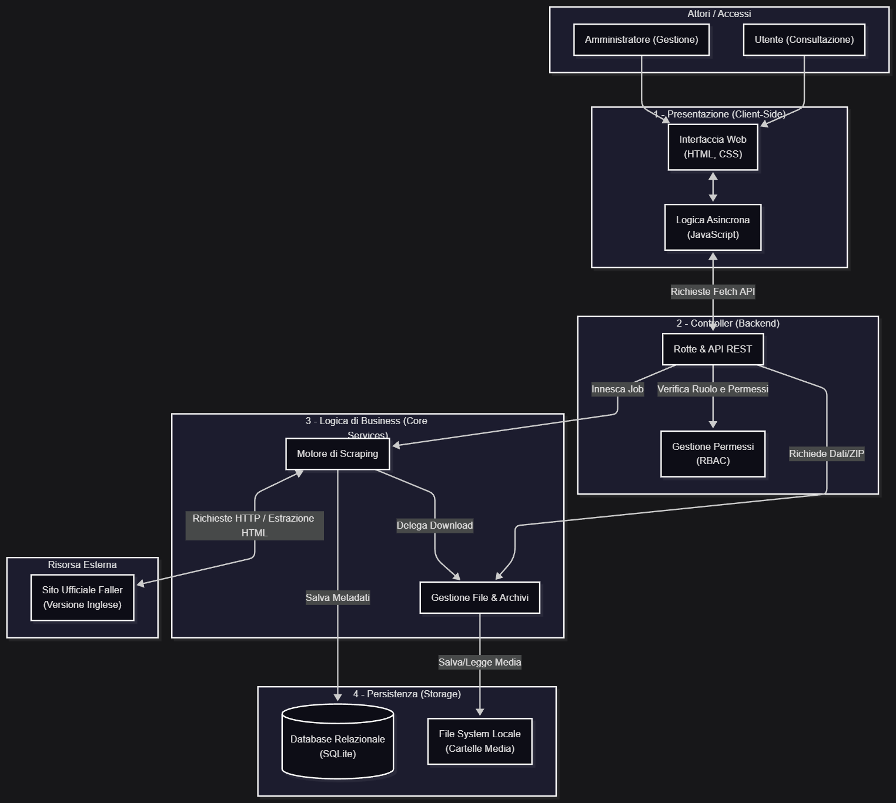

# Relazione Finale e Postmortem Dettagliato: Faller Web Harvester

* **Autore:** Luca Pontellini  
* **Repository del progetto:** [GitHub - LucaPontellini/faller-web-harvester](https://github.com/LucaPontellini/faller-web-harvester.git)  
* **Schema del Database:** [schema.sql](../webapp/schema.sql)
* **Database di Riferimento:** [SQLite3 (database.db)](../instance/database.db)
* **Sito Bersaglio:** [Faller Official Website (https://www.faller.de)](https://www.faller.de)

---

## 1. Genesi del Progetto, Evoluzione del Software e Obiettivi Didattici

L’idea alla base del **Faller Web Harvester** affonda le sue radici in un contesto squisitamente pratico e familiare, lontano da un'astratta speculazione accademica, legato alla gestione e all'espansione del plastico ferroviario di famiglia. La linea evolutiva che ha portato alla realizzazione dell'attuale ecosistema software ha attraversato tre fasi distinte, segnate da un progressivo aumento della complessità e della maturità ingegneristica.

### La Fase 0: L'inefficienza del File Word Statico

Inizialmente, la manutenzione e il censimento del nostro inventario poggiavano su un flusso di lavoro interamente manuale e rudimentale: io e mio babbo passavamo ore a consultare il sito ufficiale della Gebr. Faller GmbH, copiando e incollando codici articolo, dimensioni, prezzi e descrizioni all'interno di un file Microsoft Word statico. Questo approccio si è rivelato ben presto fallimentare per l'obsolescenza rapida dei dati (il sito Faller rinnova ciclicamente i prodotti ogni due o tre anni) e per l'altissima propensione all'errore umano durante la trascrizione di stringhe tecniche e codici EAN.

### La Fase 1: Lo Script Hobbyistico (Versione 1.0) e la Scintilla dell'Espansione

La vera e propria scintilla progettuale è scoccata nei giorni immediatamente successivi alle vacanze di Pasqua 2026. In quel periodo, stavamo ipotizzando e progettando un'importante espansione del nostro plastico ferroviario, che avrebbe dovuto accogliere un intero nuovo modulo tematico di tipo industriale e portuale. La necessità di mappare decine di nuovi kit strutturali (banchine, gru, magazzini, raccordi ferroviari, ecc.) ha reso evidente l'inadeguatezza del file Word.

Per fare fronte a questa urgenza e aiutare mio babbo a tenere traccia dei codici in modo più rapido, ho sviluppato una primissima **Versione 1.0** dell'applicazione. Si trattava di uno script grezzo, scritto quasi per passatempo e senza una reale architettura alle spalle; il suo unico scopo era automatizzare la cattura dei codici numerici per evitare il copia-incolla manuale. Nonostante la sua natura embrionale, la V1.0 ha dimostrato l'immensa utilità dell'automazione, evidenziando però al contempo tutti i limiti strutturali di uno script lineare (mancanza di una vera persistenza dei dati, fragilità strutturale davanti ai cambiamenti dell'HTML, impossibilità di scaricare allegati complessi come i manuali PDF).

### La Fase 2: Il Salto di Qualità (Versione 2.0)

L'occasione per trasformare questo passatempo in un software di livello professionale si è presentata con l'avvicinarsi della valutazione per l'ultimo progetto scolastico dell'anno. Ho deciso di "cogliere la palla al balzo", unendo l'utile al dilettevole: risolvere in modo definitivo un problema pratico familiare (la catalogazione del plastico) e sfruttare l'esigenza per sviluppare un'applicazione full-stack matura che rispondesse pienamente agli obiettivi didattici ministeriali.

È nata così la versione attuale dell'applicazione: non più un semplice script di scraping, ma un'infrastruttura modulare orientata agli oggetti, dotata di un database relazionale SQLite blindato da query parametriche, un parser difensivo governato dall'uso rigoroso di `self` e un'interfaccia dashboard reattiva basata su Flask per la consultazione e l'esportazione dei dati.

---

## 2. Scostamenti Rispetto alla Pianificazione Iniziale e Riduzione dello Scope

Il dinamismo che ha caratterizzato il ciclo di vita del software ha imposto profonde riflessioni anche sulla definizione dei confini del sistema (il cosiddetto *Project Scope*). 

### Dalla Visione Multi-Sito al Focus Monomarca

Proprio in virtù dell'entusiasmo generato dal successo della primissima versione hobbyistica e dalle ambizioni nate con la progettazione del nuovo modulo portuale del plastico, l'idea iniziale per il progetto scolastico era sensibilmente più vasta: l'obiettivo originale prevedeva lo sviluppo di una piattaforma di harvesting universale, capace di interfacciarsi contemporaneamente con tutti i diversi portali web di modellismo da cui io e mio babbo cerchiamo e acquistiamo abitualmente i prodotti (inclusi i siti di competitor storici o marchi complementari come [Noch](https://www.noch.com/), [Vollmer](https://viessmann-modell.com/en/), [Viessmann](https://viessmann-modell.com/en/), [Woodland Scenic](https://woodlandscenics.woodlandscenics.com/), [Herpa](https://www.herpa.de/en/), [Brekina](https://brekina.de/) ed altri).

Tuttavia, il passaggio da un'idea teorica alla dura realtà dello sviluppo software ha richiesto un sano bagno di realismo, spingendomi a contrarre il perimetro dell'applicazione per concentrarmi esclusivamente sul brand Faller per vari motivi fondamentali affontati nella sezione seguente.

### 2.1. Difficoltà Incontrate e Problemi Risolti

### A) Incertezza Metodologica, Selezione dello Scope e Analisi del Codice Legacy

La primissima fase del progetto è stata rallentata da un forte disorientamento in merito alla scelta dell'oggetto del progetto stesso. La mia indecisione iniziale oscillava tra due strade diametralmente opposte:

1. Proseguire e far evolvere ulteriormente il software di simulazione casinò ("Ponte's Casino"), un progetto personale su cui avevo già lavorato negli anni passati.
2. Cambiare completamente tematica, focalizzandomi sul dominio applicativo del modellismo ferroviario e della catalogazione del plastico di famiglia.

Il dubbio principale risiedeva nella fattibilità di quest'ultima scelta: temevo che una tematica apparentemente "hobbyistica" come il modellismo non offrisse abbastanza spunti tecnici per essere collegata in modo solido e multidisciplinare a tutte le materie d'esame. Una volta compreso il potenziale ingegneristico dell'automazione applicata al catalogo, si è posto il problema del "come farlo" e dell'eventuale riuso del codice.

Possedevo infatti uno script embrionale salvato su chiavetta usb (non presente nella repository GitHub). Solo dopo aver ricevuto l'approvazione del docente di Informatica, ho avviato uno studio approfondito di questo codice legacy. La transizione non è stata lineare: la difficoltà maggiore ha riguardato l'esigenza di "spezzettare" la logica monolitica e lineare del vecchio script per modularizzarla all'interno dell'architettura Model-View-Controller (MVC) richiesta dal framework Flask. Nelle prime fasi di refactoring, la frammentazione del codice ha reso complesso il tracciamento e il debugging degli errori di runtime.

### B) La Gestione Documentale e le Simulazioni di Project Management (GPOI)

Le competenze teoriche acquisite in "Gestione Progetto Organizzazione d'Impresa" (GPOI) si sono scontrate con la complessa realtà pratica della gestione di un progetto in corso d'opera. Sebbene le simulazioni in classe nel ruolo di Project Manager (sia su progetti ereditati che da avviare *ex-nihilo*) avessero fornito una base concettuale, l'assenza di un'esperienza pregressa sul campo ha reso la produzione documentale uno dei colli di bottiglia più severi.

Rispetto ai progetti passati, caratterizzati da una documentazione esigua, frammentata e priva di coerenza logica, il Faller Web Harvester ha richiesto un drastico cambio di paradigma. Ho dovuto superare la tendenza a creare report "misti", sforzandomi di diventare estremamente schematico, rigoroso e trasparente. Un'importante evoluzione metodologica è stata l'introduzione dell'**Executive Summary (ES)**, concetto appreso grazie alle spiegazioni del docente di Informatica durante il precedente modulo didattico. Ho compreso l'assoluta centralità di questo file, elevandolo a pilastro documentale obbligatorio al pari del `README.md` o del file `.gitignore` per presentare in modo sintetico l'architettura e gli obiettivi del sistema ai portatori di interesse (stakeholder).

### C) Schedulazione del diagramma di Gantt e Imprevedibilità dello Sviluppo

La stesura del diagramma di Gantt iniziale si è rivelata un esercizio puramente teorico e di difficile calibrazione. Non avendo un'idea inizialmente cristallina sullo sviluppo dell'applicazione, mappare la timeline dei task è stato complesso, tanto da costringermi a formalizzare nel documento SRS (*Software Requirements Specification*) che la pianificazione cronologica fosse da considerarsi flessibile e soggetta a variazioni in corso d'opera.

La teoria di GPOI insegna che il diagramma di Gantt, da solo, è insufficiente per catturare le interdipendenze delle attività software (per le quali sarebbero necessari diagrammi di supporto come il PERT) e che lo sviluppo software è intrinsecamente imprevedibile. Nel mio caso specifico, la schedulazione rigida è fallita a causa dei vincoli della vita scolastica: la concomitanza di verifiche, interrogazioni e carichi di studio ordinari ha reso impossibile una dedizione lineare. Lo sviluppo ha seguito un andamento discontinuo (giornate di intensa programmazione alternate a periodi di totale inattività).

Questo andamento non lineare ha esteso i tempi di sviluppo: la scrittura del codice è terminata il **16 maggio**, ovvero il giorno successivo alla scadenza originaria del 15 maggio. Fortunatamente, la concessione di una finestra temporale più ampia (fino al venerdì successivo) ha permesso di capitalizzare gli sforzi, consentendomi di completare il software al 100% e di rifinire questa documentazione postmortem.

### D) Gestione dei "Colpi di Fulmine" Progettuali (*Scope Creep* Control)

Durante la fase di programmazione pura, il flusso di lavoro è stato costantemente interrotto da intuizioni improvvise e idee incrementali (i cosiddetti "colpi di fulmine"). La tentazione di implementare immediatamente ogni nuova feature ha rischiato di compromettere la stabilità del software e di dilatare i tempi.

Per risolvere questo problema senza disperdere le idee, ho adottato una strategia di sviluppo difensiva:

1. Congelavo l'idea fino a quando la struttura generale e core del modulo corrente non fosse stabile e funzionante.
2. Inserivo tempestivamente dei commenti di promemoria e appunti direttamente nei file di codice interessati (es. contrassegnati come `TODO`).
3. Sviluppavo e integravo le nuove funzionalità solo in un secondo momento, salvaguardando l'integrità del ramo principale dell'applicazione.

### E) Prevenzione dei Blocchi di Rete, DDoS ed Etica dello Scraping

Una delle preoccupazioni ingegneristiche più persistenti ha riguardato l'impatto dei test di carico sul server della Gebr. Faller GmbH. Durante le sessioni di testing, l'applicazione si è trovata a gestire liste massive di circa 200 codici prodotto simultaneamente, o a processare intervalli numerici (range di input) potenzialmente superiori a 10.000 combinazioni.

Come analizzato nelle materie di TPSIT e Informatica, l'invio incontrollato di una simile mole di richieste in frazioni di secondo satura i socket di connessione, sovraccarica il server target fino al crash e può configurarsi come un attacco di tipo *Distributed Denial of Service* (DDoS), con conseguenti sanzioni civili o il ban permanente dell'indirizzo IP.

Il ricorso ai thread di Python per parallelizzare le richieste è stato programmaticamente scartato: sebbene avrebbe ridotto i tempi di esecuzione, l'apertura di un thread concorrente per ogni prodotto avrebbe generato un pattern di traffico altamente aggressivo e identificabile, oltre ad aumentare drasticamente la complessità algoritmica del codice.

La soluzione ha previsto l'adozione di un approccio rigidamente sincrono e dilazionato: l'inserimento di un ritardo hardware costante pari a **1 secondo** (`time.sleep(1)`) tra una richiesta HTTP e la successiva si è dimostrato il perfetto punto di equilibrio (trade-off) tra l'efficienza di scaricamento e la necessaria *politeness* di rete. Questo delay previene la saturazione dei server e distribuisce il carico in modo compatibile con una normale navigazione umana.

### F) Cambiamento di Paradigma nel Versioning (Git) e Controllo dei Commit

Nei miei progetti passati, adottavo una gestione del controllo versione estremamente destrutturata e frammentata: effettuavo commit continui e impulsivi per ogni minima modifica (arrivando spesso a oltre 140 commit per progetto), con il risultato che la quasi totalità dei salvataggi intermedi conteneva codice instabile, incompleto o affetto da errori di sintassi.

Nel Faller Web Harvester ho imposto una rigida inversione di tendenza metodologica, decidendo di non effettuare commit intermedi non testati. Ho scelto di procedere per **macro-fasi funzionali**: scrivevo il codice, ne verificavo localmente la stabilità e l'assenza di regressioni e, solo quando l'intero blocco risultava pienamente operativo al 100%, eseguivo il commit e la pubblicazione (push) su GitHub.

La presenza iniziale di restrizioni restrittive nel file `.gitignore` ha ulteriormente supportato questo approccio, impedendo il tracciamento di file spazzatura o temporanei. Questo approccio atomico e segmentato ha ridotto drasticamente il numero totale di commit sulla repository, garantendo però che ogni singola revisione memorizzata nella cronologia di Git rappresenti uno stato del software coerente, pulito, ordinato e privo di bug.

### G) Strategia di Archiviazione dei Contenuti Multimediali (Immagini e PDF) nel Database

In fase di progettazione della persistenza per la galleria fotografica (fino a 10 foto e 10 layout) e per la documentazione tecnica (`manual_pdf`, `safety_pdf`), si è presentato un classico dilemma architetturale riguardante la gestione dei file binari in un RDBMS:

1. Archiviare i file direttamente all'interno delle tabelle SQL sotto forma di oggetti binari pesanti (**BLOB - Binary Large Objects**).
2. Salvare i file fisicamente all'interno del file system del server e memorizzare nel database unicamente le stringhe di testo contenenti i path locali o gli URL di riferimento (`TEXT`).

Valutando le prestazioni del motore SQLite3, ho compreso che l'archiviazione di centinaia di file PDF e immagini ad alta risoluzione direttamente nel database avrebbe causato un'ipertrofia del file `.db` (con conseguente degradazione dei tempi di query, frammentazione del disco e saturazione della memoria RAM in fase di I/O).

La soluzione implementata nello `schema.sql` vede l'utilizzo esclusivo di colonne di tipo `TEXT`. Il backend Flask si fa carico di scaricare i file multimediali, organizzarli in cartelle dedicate sul file system locale (allineandosi alle direttive di isolamento verificate nella suite di test) e scrivere nel database solo i puntatori testuali. Questa scelta garantisce la massima leggerezza del database, velocizzando le operazioni di lettura della Dashboard web e semplificando i processi di manutenzione e backup.

### H) Complessità del Debugging in Ambienti Interconnessi

Una delle difficoltà tecniche più frustranti durante lo sviluppo è stata l'inefficacia iniziale dei messaggi di errore standard davanti a un'architettura modulare. Nonostante il terminale di sistema e la console di debug web di Flask (Werkzeug) segnalassero con precisione chirurgica il numero della riga, la variabile o la funzione in cui si era verificata l'eccezione, la risoluzione del problema non risultava immediata.

L'applicazione, essendo strutturata in package interconnessi (dove la configurazione di `config.py` impatta lo `scraper.py`, il quale alimenta il `parser.py`, che a sua volta dipende dai vincoli di unicità di `schema.sql`), si comportava come un ecosistema a cascata. Un errore tracciato in una rotta di Flask era spesso l'effetto collaterale di una mancata normalizzazione a monte nel parser o di una violazione di un vincolo sul database. Per superare questa barriera, ho dovuto affinare le mie capacità di lettura della traccia dello stack (*stack trace*), imparando a non focalizzarmi solo sul punto di rottura finale, ma a risalire l'intera catena delle chiamate per comprendere le dipendenze logiche tra i moduli.

### I) Refactoring Estetico del Codice: La Standardizzazione dei Commenti

Dal punto di vista della manutenibilità del software, ho sempre ritenuto fondamentale il principio secondo cui *"anche l'occhio vuole la sua parte"*. Tuttavia, l'inserimento dei commenti esplicativi in contemporanea alla scrittura degli algoritmi frammentava la mia concentrazione, alterando il flusso logico della programmazione.

Per risolvere questo conflitto, ho scelto di posticipare la documentazione in-line: ho redatto l'intera struttura dei commenti tecnici e delle docstring solo in una fase conclusiva, a codice ormai stabilizzato. La sfida è stata garantire che questa documentazione "tardiva" non perdesse di efficacia o di chiarezza, sforzandomi di adottare una terminologia che rendesse il codice auto-esplicativo e immediatamente comprensibile a lettori terzi, standardizzando l'aspetto visivo dei blocchi di codice.

### J) Problemi Minori: Naming Convention e Interfaccia Utente (UI)

A livello di frontend e micro-progettazione, si sono riscontrate due difficoltà minori:

* **Naming Convention:** La scelta dei nomi dei file, delle variabili e delle rotte ha risentito di una mia iniziale mancanza di inventiva terminologica. Il problema è stato risolto imponendo l'uso rigido delle convenzioni standard di Python (snake_case) e Flask per mantenere la coerenza visiva e formale del codice.
* **Progettazione della Dashboard:** Inizialmente non possedevo un'idea chiara su come strutturare l'interfaccia di consultazione dei dati. Il problema è stato brillantemente superato conducendo un'analisi di benchmarking su piattaforme e-commerce leader di mercato (in particolare Amazon). Studiando la loro disposizione dei filtri, la formattazione delle tabelle riassuntive e la gerarchia visiva delle schede prodotto, ho mutuato le migliori pratiche di UX/UI, declinandole efficacemente all'interno dei template HTML/CSS della dashboard del Faller Web Harvester.

---

## 3. Architettura di Sistema e Mappatura Inter-Documentale

Per garantire la massima manutenibilità ed estendibilità del software, l'applicazione è stata ingegnerizzata seguendo una rigida separazione delle responsabilità (*Separation of Concerns*), strutturando il codice in package e classi autonome. La disposizione dei file e il ciclo di vita del progetto sono intimamente legati all'intera suite documentale che correda la repository.

Come dettagliato nel documento **[**Project Structure (PS)**](./Project%20Structure%20(PS).md)**, la radice del progetto separa la logica applicativa Web dalla documentazione d'ufficio e dai diagrammi architetturali. La catena dei vincoli e delle funzionalità operative trova invece la sua formale legittimazione nei seguenti file coordinati:

* **[Pianificazione e Casi d'Uso](./usecase.puml):** Questo file sorgente PlantUML modella le azioni degli attori del sistema. Separa nettamente l'attore *Utente standard* (abilitato alle funzioni di **ricerca**, **avvio dello scraping**, **filtraggio**, **generazione di report della Dashboard** e **rimozione dei dati**) dall'attore *Amministratore*, il quale possiede l'esclusiva per l'attivazione dei **moduli di scan del sistema (immagini e PDF)**, la cancellazione dei record del database e il reset totale del catalogo estratto.

* **[Mappatura Multidisciplinare](Cross-Disciplinary%20Mapping%20(CDM).md):** Introduce il framework dei collegamenti d'esame e rimanda direttamente alla mappa concettuale del progetto, mostrando visivamente come le competenze dell'indirizzo informatico convergano nell'applicazione.

* **[Integrità del Codice](Test%20Suite.md):** Descrive la suite di test automatizzati basata su `pytest`. Mediante l'utilizzo di fixture nel file [`conftest.py`](../webapp/tests/conftest.py), la suite isola completamente l'ambiente di produzione simulando risposte di rete fittizie (mocking) per convalidare il parser e verificare che i meccanismi di protezione dei ruoli (RBAC) della dashboard blocchino accessi non autorizzati all'area `/admin/`.

---

## 4. Analisi del DOM HTML e la Sfida delle "Inconsistenze Linguistiche"

Uno dei nodi problematici più complessi affrontati durante lo sviluppo è emerso dall'analisi empirica delle pagine dei prodotti. La discrepanza tra il comportamento teorico atteso dal protocollo HTTP e l'effettiva struttura dei dati ha imposto precise scelte nel file di configurazione e nel parser.

### 4.1 Forzatura della Localizzazione e "Linguistic Leakage"

A livello architetturale, l'applicazione è progettata per estrarre esclusivamente la versione in lingua inglese del catalogo. Nel file **[`config.py`](../webapp/config.py)**, questa sottomissione controllata viene implementata iniettando i parametri di localizzazione all'interno di ogni richiesta di rete tramite il metodo statico `get_random_headers()`:

```python
    @staticmethod
    def get_random_headers():
        # Restituisce header HTTP con User-Agent casuale e lingua forzata in EN (Inglese)
        return {
            "User-Agent": random.choice(Config.USER_AGENTS),
            "Accept-Language": "en-US,en;q=0.9",
            "Accept": "text/html,application/xhtml+xml,application/xml;q=0.9,image/avif,image/webp,*/*;q=0.8",
            "Referer": Config.BASE_URL,
            "Connection": "keep-alive"
        }
```

Tuttavia, il server target soffre di un'anomalia nota come *linguistic leakage* (infiltrazione linguistica). Pur ricevendo l'header `"Accept-Language": "en-US,en;q=0.9"`, il server fallisce nel tradurre interamente il DOM, lasciando ampie porzioni di testo nativo in tedesco.

L'evidenza di questa anomalia si trova nel tracciamento JavaScript (dataLayer) esaminando il codice sorgente della pagina dell'Altoforno ([`130026`](https://www.faller.de/en/miniature-worlds/busy-world-of-business/21359/blast-furnace-with-casting-hall)):

```html
<script>
window.dataLayer.push({
    "ecommerce": {
        "detail": {
            "actionField": {"list": "Eifrige Geschäftswelt"},
            "products": [{
                "name": "Hochofen mit Gießhalle",
                "id": "130026",
                "price": "799.99",
                "brand": "FALLER",
                "category": "Eifrige Geschäftswelt",
                "variant": ""
            }]
        },
        "currencyCode": "EUR"
    }
});
</script>
```

Come si nota, il nome del prodotto (`"Hochofen mit Gießhalle"`) e la categoria (`"Eifrige Geschäftswelt"`) vengono restituiti in tedesco.

### 4.2 Incoerenza Semantica nelle Proprietà Tecniche

Il problema si riflette anche nella tabella delle proprietà visibili all'utente. Analizzando il blocco `.product-properties-content`, ci si scontra con etichette ibride:

```html
<div class="product-property-row">
    <span class="property-label">Difficulty Level:</span>
    <span class="property-value">Sehr anspruchsvoll</span> 
</div>
```

Mentre la *label* viene tradotta ("Difficulty Level"), il valore rimane in tedesco ("Sehr anspruchsvoll"). Questo comportamento rende impossibile affidarsi a un'estrazione cieca dei dati e ha richiesto lo sviluppo di un parser specifico e resiliente in Python.

---

## 5. Implementazione del Parser Procedurale e Mappatura Dinamica

Per gestire la volatilità del DOM e garantire la normalizzazione del dato, il modulo **[`parser.py`](../webapp/services/scraper/parser.py)** è stato strutturato con un approccio procedurale robusto, basato su funzioni di sanificazione e dizionari di mappatura, abbandonando complessi (e fragili) costrutti orientati agli oggetti.

### 5.1 La Funzione di Sanificazione `clean_val`

Il primo strato di difesa contro i dati sporchi è la funzione di sanificazione. Il sito Faller utilizza spesso caratteri speciali (come i checkmark `✓`), doppi apici e formattazioni con spaziature irregolari.

```python
def clean_val(text):
    if not text:
        return "N/A"
    clean = text.replace("✓", "").replace('"', '').replace('\n', ' ').strip()
    return " ".join(clean.split())
```

Questa funzione garantisce che ogni stringa estratta sia pulita e adatta all'esportazione su Excel o all'inserimento nel database. Se un dato manca sul sito sorgente, viene assegnato automaticamente il valore di fallback `"N/A"`.

### 5.2 Mappatura Logica dei Campi (Dictionary Mapping)

Piuttosto che creare funzioni separate per ogni singolo dato, all'interno della funzione principale `parse_product_page` è stato implementato un dizionario di mappatura (`mapping`). Questa soluzione ingegneristica confronta dinamicamente le etichette HTML testuali con i nomi dei campi attesi nel database:

```python
    # 3. Proprietà tecniche (At a glance)
    mapping = {
        "dimensions": "dimensions",
        "track gauge": "scale_image",
        "epoch": "epoch",
        "kit contains": "kit_contains",
        "difficulty": "difficulty",
        "delivery date": "delivery_date",
        "kategorie": "category",
        "category": "category",
        "ean": "ean",
        "lighting/electronics": "lighting_or_electronics",
        "construction instruction": "construction_instruction"
    }
```

Il parser itera su tutte le label presenti in pagina, converte il testo in minuscolo e lo pulisce dai due punti. Se la label corrisponde a una chiave del dizionario, il valore adiacente viene estratto, passato a `clean_val()` e salvato. Questo rende il parser estremamente rapido e facilmente espandibile (basta aggiungere una riga al dizionario per estrarre un nuovo parametro).

---

## 6. Design del Database: Analisi Critica di `schema.sql`

La persistenza dei dati e dei collegamenti ai file fisici avviene all'interno del database SQLite3 locale, la cui architettura è codificata nel file **[`schema.sql`](../webapp/schema.sql)**. Lo schema implementa scelte strutturali mirate a massimizzare l'efficienza di lettura per la dashboard web.

### 6.1 Denormalizzazione Controllata per la Galleria Multimediale

Osservando la definizione della tabella `product`, si nota l'adozione di un design "piatto" per la memorizzazione dei path locali di immagini e layout tecnici, predisponendo esattamente 10 slot fissi per categoria:

```sql
CREATE TABLE product (
    id INTEGER PRIMARY KEY AUTOINCREMENT,
    code TEXT UNIQUE NOT NULL,
    -- ... altri campi tecnici ...
    image_main TEXT,
    -- Foto gallery (da 1 fino a 10)
    photo_1 TEXT, photo_2 TEXT, photo_3 TEXT, photo_4 TEXT, photo_5 TEXT,
    photo_6 TEXT, photo_7 TEXT, photo_8 TEXT, photo_9 TEXT, photo_10 TEXT,
    -- Layout / Piante (da 1 fino a 10)
    layout_1 TEXT, layout_2 TEXT, layout_3 TEXT, layout_4 TEXT, layout_5 TEXT,
    layout_6 TEXT, layout_7 TEXT, layout_8 TEXT, layout_9 TEXT, layout_10 TEXT,
    -- ...
);
```

Dal punto di vista puramente accademico e relazionale, la presenza di colonne cicliche viola la Prima Forma Normale (1FN), che richiederebbe una tabella separata `product_images` con relazione $1:N$.

Tuttavia, dal punto di vista dell'ingegneria del software e dello sviluppo pratico, questa denormalizzazione rappresenta una scelta ponderata dettata da tre fattori principali:

1. **Dimensionamento di Sicurezza (Overprovisioning):** Il limite massimo di 10 foto e 10 layout è stato impostato volontariamente per "tenersi larghi". Analizzando a campione il catalogo Faller, ho stabilito un margine (*buffer*) in grado di accogliere senza errori anche le schede dei prodotti più complessi o ricchi di dettagli fotografici.
2. **Semplicità Implementativa e Logica UPSERT:** Questo approccio permette di trattare l'inserimento o l'aggiornamento di un prodotto come una singola transazione atomica piatta, basata sul vincolo di unicità `UNIQUE(code)`. Si evita così di dover gestire logiche complesse di cancellazione a cascata, prevenendo il rischio di generare record multimediali "orfani" in tabelle collegate.
3. **Neutralizzazione dei Join SQL:** La dashboard Flask deve estrarre record completi per popolare la griglia informativa in tempo reale. Evitare l'esecuzione di complesse query di `JOIN` tra più tabelle alleggerisce drasticamente il carico di I/O sul motore SQLite, garantendo tempi di risposta ottimali lato frontend.

### 6.2 Neutralità Linguistica dello Schema

Come documentato nei commenti in cima al file `schema.sql`, il database è programmaticamente progettato per essere **"neutrale rispetto alla lingua"**. I campi di tipo `TEXT` accolgono le stringhe estratte ed elaborate dalla funzione `clean_val()` esattamente come si presentano, senza imporre vincoli di lingua a livello di schema.

Ciò trasferisce l'intero onere dell'interpretazione e normalizzazione linguistica (necessario per gestire le anomalie come il *linguistic leakage*) al livello applicativo (Interfaccia/UI). Questa separazione delle responsabilità garantisce che lo strato di persistenza rimanga solido e immutabile: non saranno necessarie costose alterazioni strutturali della tabella nel caso in cui, in futuro, si decidesse di abilitare il software per effettuare lo scraping completo delle versioni del catalogo in lingua francese o olandese.

---

## 7. Conclusioni e Sviluppi Futuri

Il **Faller Web Harvester** ha pienamente soddisfatto gli obiettivi per cui è stato concepito: il catalogo su file Word è stato definitivamente dismesso e sostituito da un database relazionale dinamico, regolarmente aggiornato tramite l'applicazione Flask.

Qualora il progetto dovesse affrontare una futura release di produzione o un'estensione del tempo a disposizione, i passaggi raccomandati prevedono:

* **La Normalizzazione Relazionale:** Superare la barriera fissa delle 10 colonne per le immagini, migrando la galleria multimediale verso la corretta forma normale tramite tabella dipendente $1:N$.
* **Strato di Traduzione Asincrono:** Integrare un middleware (es. tramite librerie DeepL o Google Translate API) che intercetti le stringhe che il sito Faller fallisce nel tradurre nativamente, traducendole automaticamente prima di effettuare il commit finale nel database.

---

Si capisce, ma puoi renderlo ancora più evidente e "accademico" aggiungendo una legenda o modificando leggermente l'ordine del testo descrittivo.

Il diagramma in sé è ottimo perché mostra sia la **struttura statica** (i livelli dell'applicazione, gli attori, il database) sia la **dinamica comportamentale** (le frecce che indicano come si muovono le richieste). Per togliere qualsiasi dubbio a chi legge ed evitare che venga confuso con un semplice schema dei moduli, il segreto è **definire esplicitamente la duplice natura del diagramma** nel testo introduttivo.

Ecco una proposta di riscrittura e organizzazione per l'Appendice, pensata per essere inserita direttamente nella tua relazione. Rende cristallino il fatto che questo schema rappresenti la generalizzazione dell'intero flusso del sistema:

---

Hai perfettamente ragione, scusami! Sono andato decisamente lungo.

Ecco la versione **essenziale, dritta al punto e pulita** per la tua Sezione 8. Prendi questa e sei a posto:

---

## 8. Appendice: Architettura di Sistema e Flusso Generale del Dato

Il diagramma sottostante fornisce una **visione d'insieme e generalizzata** del sistema *Faller Web Harvester*. Mappa in un unico schema sia la struttura architetturale a livelli (N-Tier), sia l'interconnessione dinamica dei componenti durante il flusso di scraping e consultazione dei dati.



Il diagramma è generato a partire dal file Mermaid: [`architecture_overview.mmd`](../docs/mermaid/architecture_overview.mmd)

### Guida alla Lettura del Diagramma

Per comprendere l'interconnessione dei componenti, lo schema si analizza su due vettori:

* **Dislocazione Architetturale (I Blocchi):** L'applicazione segue una rigida separazione dei livelli (*Separation of Concerns*). Il flusso si muove verticalmente dal Livello 1 (Client) al Livello 4 (Persistenza), impedendo comunicazioni dirette tra strati non contigui (es. la UI non interroga mai direttamente il DB).

* **Ciclo di Vita e Strategia di Archiviazione (I Flussi):** I dati raccolti dal *Motore di Scraping* vengono separati all'origine per ottimizzare le prestazioni complessive:

1. **Database SQLite:** Archiviazioni dei soli metadati testuali strutturati (codici, descrizioni, prezzi) per garantire ricerche e filtri immediati in dashboard.
2. **File System Locale ([`faller_catalogo`](../faller_catalogo/)):** Salvataggio fisico dei file binari pesanti (immagini e PDF dei manuali) che si occupa anche di comprimerli in formato ZIP o esportarli in fogli Excel su richiesta dell'utente.

---

### Riferimenti Incrociati della Documentazione

Per una visione dettagliata di come i singoli moduli qui schematizzati siano stati pianificati e testati, fare riferimento ai relativi documenti di progetto:

- [**Script principale**](../run.py)
- [**README del progetto**](../README.md)
- [**Executive Summary (ES).md**](../docs/Executive%20Summary%20(ES).md)
- [**Software Requirements Specification (SRS)**](./Software%20Requirements%20Specification%20(SRS).md)
- [**Project Structure (PS)**](./Project%20Structure%20(PS).md)
- [**Cross-Disciplinary Mapping (CDM)**](./Cross-Disciplinary%20Mapping%20(CDM).md)
- [**Test Suite.md**](../docs/Test%20Suite.md)