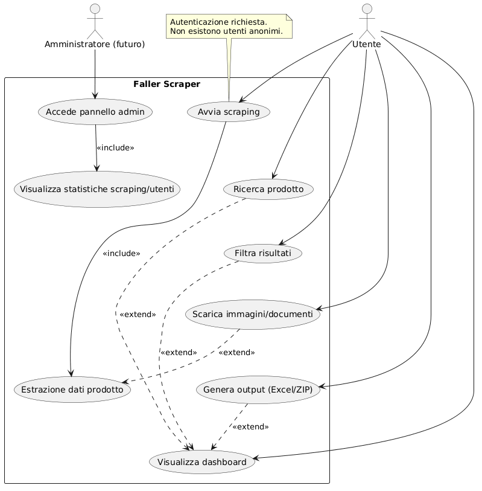
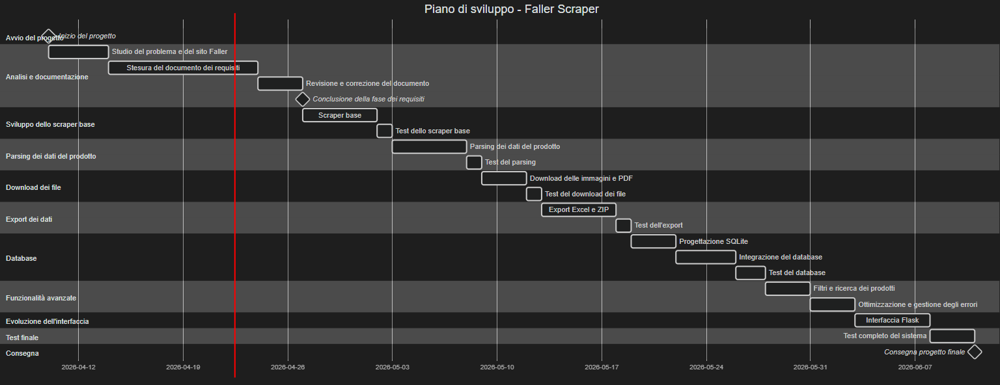
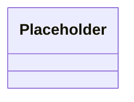

# Documento dei Requisiti – Sistema Web Scraping Gebr. Faller GmbH

## 1. Introduzione

### 1.1 Scopo del documento
Descrivere i requisiti tecnici e funzionali del software "Faller Scraper". Il documento funge da guida per lo sviluppo modulare e per la futura integrazione con database e interfacce web.

### 1.2 Contesto
Il progetto è nato poco prima delle vacanze di Pasqua 2026 per risolvere un'inefficienza reale nella gestione del plastico ferroviario di famiglia. 
- **Il problema**: Inizialmente, io e mio babbo cercavamo gli articoli sul sito della [Faller](https://www.faller.de/en/) e trascrivevamo manualmente codici e dati in tabelle Word.
- **L'aggiornamento dati**: Poiché Faller aggiorna il sito e i prodotti ogni 2/3 anni, il nostro catalogo su Word diventava obsoleto velocemente.
- **La soluzione**: Ho sviluppato questo programma in Python per automatizzare il "lavoro sporco", permettendo a me e a mio babbo di avere sempre i dati aggiornati, le foto e i manuali pronti all'uso per la costruzione del plastico.

## 2. Obiettivi generali
* Automatizzare l’estrazione dei dati dal sito della Gebr. Faller GmbH tramite web scraping.
* Recuperare informazioni sui prodotti come codici, descrizioni, immagini e documentazione tecnica.
* Ridurre il lavoro manuale necessario per la creazione e l’aggiornamento del catalogo del plastico ferroviario.
* Organizzare i dati in modo strutturato per facilitarne la consultazione e l’utilizzo.
* Esportare i dati estratti in formati utilizzabili come Excel e archivi ZIP.

## 3. Stakeholder e Attori
| Stakeholder           | Ruolo                         | Interesse |
|-----------------------|-------------------------------|-----------|
| Sito web della FALLER | Fonte dei dati                | Fornire contenuti aggiornati da cui estrarre informazioni |
| Studente              | Sviluppatore                  | Realizzare il progetto rispettando i requisiti, gestirne il codice e la manutenzione per futuri miglioramenti |
| Docente               | Valutatore                    | Verificare correttezza tecnica, completezza e qualità della progettazione |
| Utente Finale         | Utilizzatore del sistema      | Utilizzare l’applicazione per consultare, estrarre e organizzare automaticamente i dati del catalogo Faller (prodotti, immagini e documenti) |

### 3.1 Attori principali

- `Utente` → utilizza il sistema per avviare il web scraping del catalogo Faller, consultare i dati estratti e generare output come Excel, PDF e archivi ZIP
- `Sistema Faller` → sito web esterno da cui vengono estratti automaticamente dati, immagini e documentazione del catalogo

### 3.2 Attori opzionali (solo in futuro con Flask)

- `Utente autenticato` → utente che accede tramite interfaccia web Flask per avviare e gestire il processo di scraping in modo guidato
- `Amministratore del sistema` → consulta la propria dashboard per vedere l'andamento dello scraper ed altri dettagli tecnici

## 4. Requisiti funzionali

### 4.1 Estrazione e Parsing

- Il sistema deve permettere la ricerca automatica dei prodotti tramite URL diretti o liste di codici.
- Il sistema deve gestire la ricerca del prodotto tramite query sul sito Faller e recuperare il link diretto alla pagina prodotto.
- Il sistema deve estrarre i principali dati tecnici dei prodotti, tra cui: codice, nome, scala, disponibilità, dimensioni, epoca, EAN e descrizione.
- Il sistema deve analizzare il contenuto HTML della pagina prodotto tramite parsing (BeautifulSoup) e selettori CSS.
- Il sistema deve supportare la gestione di dati strutturati e non strutturati presenti nella sezione “At a glance”.

I dati estratti vengono organizzati nei seguenti campi principali:

### Campi estratti dal sistema

| Campo                            | Descrizione                                      | Tipo di dato |
|----------------------------------|--------------------------------------------------|--------------|
| `code`                           | Codice prodotto Faller                           | string       |
| `exists`                         | Indica se il prodotto esiste/è disponibile       | boolean      |
| `name`                           | Nome del prodotto                                | string       |
| `scale`                          | Scala del modello (es. H0, N, Z)                 | string       |
| `availability`                   | Stato di disponibilità                           | string       |
| `dimensions`                     | Dimensioni del modello                           | string       |
| `epoch`                          | Epoca ferroviaria                                | string       |
| `kit_contains`                   | Contenuto del kit                                | string       |
| `lighting`                       | Informazioni sull’illuminazione                  | string       |
| `category`                       | Categoria del prodotto                           | string       |
| `ean`                            | Codice EAN                                       | string       |
| `description`                    | Descrizione testuale                             | string       |
| `product_link`                   | URL della pagina prodotto                        | string (URL) |
| `image_main`                     | Immagine principale                              | string (URL) |
| `photo_1` … `photo_10`           | Foto aggiuntive                                  | string (URL) |
| `layout_pdf_1` … `layout_pdf_10` | Layout PDF associati                             | string (URL) |
| `manual_pdf`                     | Manuale PDF                                      | string (URL) |
| `safety_pdf`                     | Scheda di sicurezza PDF                          | string (URL) |

- Il sistema deve eseguire la sanificazione dei dati testuali per garantire una corretta esportazione in Excel (rimozione caratteri speciali, virgolette, simboli e spazi inutili).
- Il sistema deve gestire la presenza di dati mancanti assegnando il valore "N/A".
- Il sistema deve normalizzare i campi estratti per garantire coerenza tra prodotti differenti.

### Nota tecnica:

Il parsing dei dati è stato progettato per essere resiliente ai cambiamenti del sito web, grazie all’uso di selettori CSS e controlli di fallback sui dati mancanti.

### 4.2 Multimedia e PDF
- Il sistema deve scaricare automaticamente le immagini associate ai prodotti, fino a un massimo di 10 per elemento.
- Il sistema deve evitare duplicati nelle immagini tramite controllo di hash MD5.
- Il sistema deve scaricare documentazione tecnica come manuali e schede di sicurezza.
- Il sistema deve convertire automaticamente file immagine non strutturati (es. JPG singoli) in formato PDF.

### 4.3 Persistenza e Caching
- Il sistema deve salvare temporaneamente i dati in cache JSON per evitare richieste ripetute al server.
- Il sistema deve implementare un meccanismo di retry automatico in caso di errori di rete o blocchi temporanei.

### 4.4 Output e Archiviazione
- Il sistema deve generare un file Excel dinamico contenente tutti i dati estratti.
- Il file Excel deve includere anteprime delle immagini, link cliccabili e indicatori per i prodotti non disponibili.
- Il sistema deve creare archivi ZIP contenenti dati, immagini e documenti con timestamp per la conservazione e il trasporto.

## 4.5. User Stories

- Come utente voglio avviare il web scraping del catalogo Faller per ottenere automaticamente dati aggiornati dei prodotti
- Come utente voglio visualizzare i dati estratti per consultarli facilmente
- Come utente voglio filtrare i prodotti in base a criteri specifici (scala, epoca, categoria) per trovare rapidamente le informazioni desiderate
- Come utente voglio esportare i dati in formato Excel per utilizzarli offline
- Come utente voglio scaricare immagini e documenti dei prodotti per utilizzarli nel progetto del plastico ferroviario
- Come utente voglio creare un archivio ZIP per salvare e trasportare i dati
- Come utente voglio consultare i dati tramite un’interfaccia web basata su Flask (futuro)

## 5. Requisiti Non Funzionali

- Il sistema deve essere eseguibile in ambiente Python locale senza dipendenze complesse
- Il sistema deve gestire errori di rete senza interrompere l’esecuzione (retry automatici)
- Il sistema deve garantire la coerenza dei dati salvati in cache JSON
- Il sistema deve limitare le richieste al sito esterno per evitare sovraccarichi (rate limiting)
- Il sistema deve essere modulare e suddiviso in componenti riutilizzabili
- Il sistema deve supportare future estensioni verso un’interfaccia web basata su Flask e database SQLite
- Il sistema deve mantenere un comportamento etico nelle richieste (delay tra le chiamate HTTP)
- Il sistema deve garantire resilienza tramite gestione degli errori e tentativi di riconnessione automatici
- Il sistema deve garantire la sicurezza delle credenziali utente (in caso di estensione web) tramite hashing delle password
- Il sistema deve offrire una buona usabilità tramite un’interfaccia web responsiva, accessibile anche da dispositivi mobili
- Il sistema deve adottare un’architettura modulare (es. pattern Repository) per separare la logica di accesso ai dati dallo scraping

## 6. Casi d'uso

### 6.1 Casi d’uso principali

1. `Avvio scraping prodotti`
2. `Ricerca prodotto`
3. `Visualizzazione pagina prodotto`
4. `Estrazione dati prodotto`
5. `Download immagini e documenti`
6. `Generazione file Excel`
7. `Creazione archivio ZIP`
8. `Visualizzazione dati estratti`

### 6.2 Descrizione semplificata dei casi d’uso

- **Avvio scraping prodotti**: l’utente avvia il sistema per iniziare il processo di raccolta dati dal sito Faller.
- **Ricerca prodotto**: il sistema permette di cercare un prodotto tramite codice o parola chiave.
- **Visualizzazione pagina prodotto**: il sistema accede alla pagina del prodotto sul sito Faller.
- **Estrazione dati prodotto**: il sistema analizza la pagina e recupera le informazioni principali del prodotto.
- **Download immagini e documenti**: il sistema scarica automaticamente immagini e file PDF associati al prodotto.
- **Generazione file Excel**: il sistema organizza i dati estratti in un file Excel.
- **Creazione archivio ZIP**: il sistema comprime dati, immagini e documenti in un unico archivio.
- **Visualizzazione dati estratti**: l’utente può consultare i dati raccolti in modo ordinato.

### 6.3 Diagramma dei casi d’uso

Il diagramma è generato a partire dal file PlantUML: [`usecase.puml`](usecase.puml)

### 6.4 Relazioni tra casi d'uso: include ed extend

I casi d’uso sono collegati tra loro tramite relazioni di tipo include ed extend.

Include:
- "Estrazione dati prodotto" include "Visualizzazione pagina prodotto"
- "Download immagini e documenti" include "Estrazione dati prodotto"
- "Generazione file Excel" include "Estrazione dati prodotto"

Extend:
- "Creazione archivio ZIP" estende "Generazione file Excel" (funzionalità opzionale)
- "Visualizzazione dati estratti" estende "Generazione file Excel" (consultazione opzionale)

## 7. Glossario dei termini
- **Utente**: utilizzatore del sistema che avvia il processo di web scraping, consulta i dati estratti e gestisce l’esportazione (Excel, PDF e archivi ZIP)
- **Web Scraping**: tecnica di estrazione automatica di dati da pagine web, utilizzata per recuperare informazioni dal sito Faller
- **Sito web della Faller**: sito web esterno da cui vengono estratti dati, immagini e documentazione relativi ai prodotti del catalogo
- **Prodotto**: elemento del catalogo Faller contenente informazioni come codice, nome, scala, epoca, dimensioni, immagini e documenti associati
- **Parser**: componente del sistema che analizza il contenuto HTML delle pagine e ne estrae dati strutturati
- **Downloader**: modulo responsabile del download di immagini e documenti associati ai prodotti
- **Cache**: sistema di memorizzazione locale (in formato JSON) utilizzato per evitare richieste duplicate e velocizzare il processo di scraping
- **Excel dinamico**: file di output generato automaticamente contenente i dati dei prodotti, con link e anteprime
- **Backup ZIP**: archivio compresso contenente dati, immagini e documenti esportati dal sistema
- **Hash MD5**: firma digitale univoca di un file utilizzata per identificare eventuali duplicati
- **EAN**: codice a barre internazionale per l'identificazione univoca del prodotto
- **Scala (Track Gauge)**: rapporto di riduzione del modello ferroviario (es. H0, N, Z)
- **Epoca**: periodo storico ferroviario di riferimento del modello
- **Rate limiting**: tecnica utilizzata per limitare il numero di richieste inviate a un server
- **Flask**: framework Python utilizzato per lo sviluppo di applicazioni web
- **SQLite**: database relazionale leggero basato su file locale
- **Database**: sistema di archiviazione strutturata dei dati che permette interrogazioni e gestione efficiente delle informazioni

## 8. Pianificazione e milestone

### 8.1 Gantt

Il diagramma di Gantt è generato a partire dal file Mermaid: [`gantt.mmd`](gantt.mmd)

### Nota realistica di progetto

Il piano temporale rappresenta una stima teorica delle attività. In pratica lo sviluppo viene eseguito in modalità non continuativa (time-based), in base alla mia disponibilità. Questo comporta possibili variazioni nella durata delle singole fasi.

## 9 Entità e relazioni (Schema ER)

## 10. Diagramma UML delle classi

---

## 11. Web Scraping: spiegazione, aspetti legali ed etici

Il **web scraping** è una tecnica che permette di estrarre automaticamente dati da siti web tramite programmi.
Nel presente progetto viene utilizzato per raccogliere informazioni dal sito della [Gebr. Faller GmbH](https://www.faller.de/en/), come prodotti, immagini e documentazione.

### Differenza tra uso personale e uso commerciale

Nel web scraping è fondamentale distinguere tra **uso personale** e **uso commerciale**, poiché comportano implicazioni legali diverse.

- L’uso personale riguarda l’utilizzo dei dati per scopi privati, come studio, organizzazione o hobby. In questo caso, lo scraping può essere lecito se i dati sono pubblicamente accessibili e vengono rispettate le condizioni di utilizzo del sito.
Il riferimento normativo principale per i dati personali è il [Regolamento generale sulla protezione dei dati (GDPR)](https://eur-lex.europa.eu/eli/reg/2016/679/oj), anche se nel presente progetto vengono trattati esclusivamente dati relativi a prodotti. Nel presente progetto, i dati vengono raccolti esclusivamente per gestire il plastico ferroviario, rientrando quindi in un uso personale e didattico.

- L’uso commerciale implica invece l’utilizzo dei dati per ottenere un vantaggio economico o per pubblicarli su piattaforme accessibili ad altri utenti. Questo tipo di utilizzo è più regolato e può richiedere autorizzazioni, poiché può coinvolgere aspetti legati al copyright e ai diritti sui contenuti secondo la [Direttiva sul diritto d'autore nel mercato unico digitale](https://eur-lex.europa.eu/eli/dir/2019/790/oj).

In sintesi, mentre l’uso personale è generalmente più permissivo, l’uso commerciale richiede maggiore attenzione e il rispetto delle normative vigenti.

### Riferimenti e fonti ufficiali

Per verificare le condizioni di utilizzo dei dati del sito è possibile consultare:

- [Privacy policy - protezione dei dati personali e accessi](https://www.faller.de/en/data-protection)
- [Termini e condizioni del sito - regole di utilizzo](https://www.faller.de/en/terms-and-conditions/)
- [File robots.txt - indicazioni tecniche per i crawler](https://www.faller.de/robots.txt)