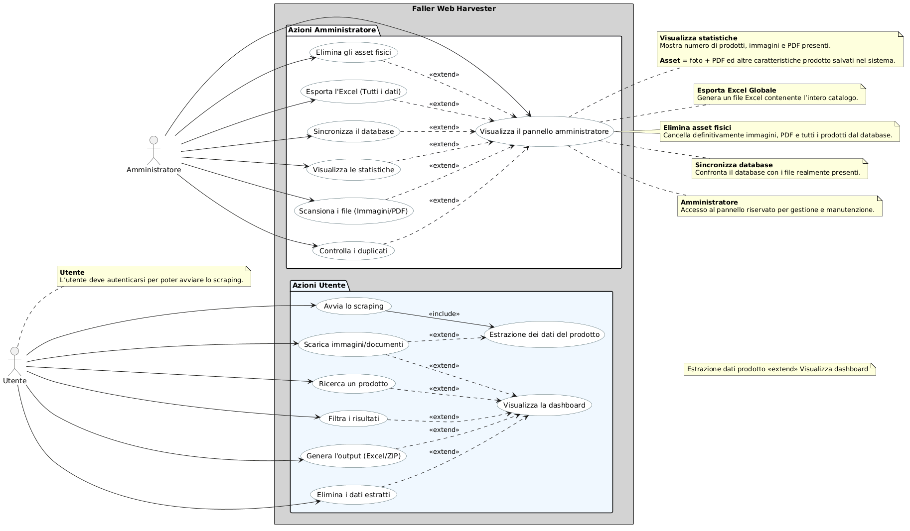
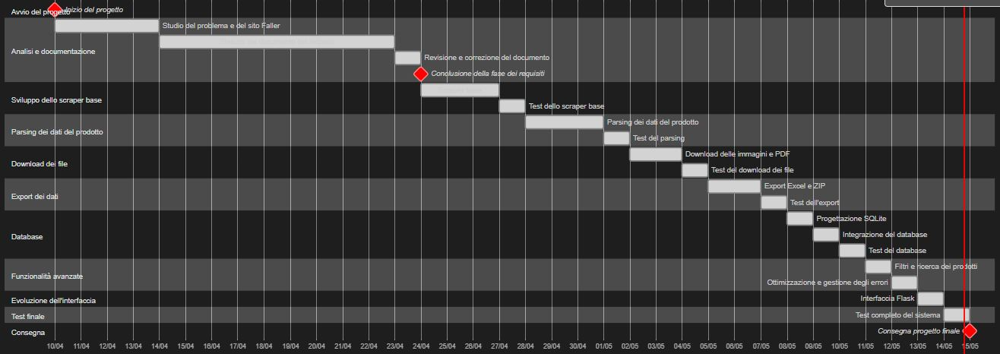
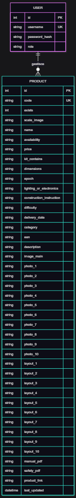
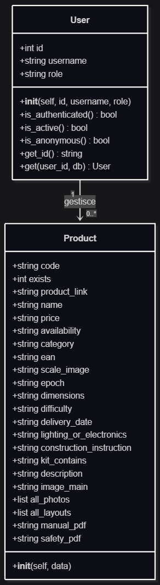

# Documento dei Requisiti – Sistema Web Scraping Gebr. Faller GmbH

## 1. Introduzione

### 1.1 Scopo del documento
Descrivere i requisiti tecnici e funzionali del software "Faller Scraper". Il documento funge da guida per lo sviluppo modulare e per la futura integrazione con database e interfacce web.

### 1.2 Contesto
Il progetto è nato poco prima delle vacanze di Pasqua 2026 per risolvere un'inefficienza reale nella gestione del plastico ferroviario di famiglia. 
- **Il problema**: Inizialmente, io e mio babbo cercavamo gli articoli sul sito della [Faller](https://www.faller.de/en/) e trascrivevamo manualmente codici e dati in tabelle Word.
- **L'aggiornamento dati**: Poiché Faller aggiorna il sito e i prodotti ogni 2/3 anni, il nostro catalogo su Word diventava obsoleto velocemente.
- **La soluzione**: Ho sviluppato questo programma in Python per automatizzare il "lavoro sporco", permettendo a me e a mio babbo di avere sempre i dati aggiornati, le foto e i manuali pronti all'uso per la costruzione del plastico.

## 2. Obiettivi generali
* Automatizzare l’estrazione dei dati dal sito della Gebr. Faller GmbH tramite web scraping.
* Recuperare informazioni sui prodotti come codici, descrizioni, immagini e documentazione tecnica.
* Ridurre il lavoro manuale necessario per la creazione e l’aggiornamento del catalogo del plastico ferroviario.
* Organizzare i dati in modo strutturato per facilitarne la consultazione e l’utilizzo.
* Esportare i dati estratti in formati utilizzabili come Excel e archivi ZIP.

## 3. Stakeholder e Attori
| Stakeholder           | Ruolo                         | Interesse |
|-----------------------|-------------------------------|-----------|
| Sito web della FALLER | Fonte dei dati                | Fornire contenuti aggiornati da cui estrarre informazioni |
| Studente              | Sviluppatore                  | Realizzare il progetto rispettando i requisiti, gestirne il codice e la manutenzione per futuri miglioramenti |
| Docente               | Valutatore                    | Verificare correttezza tecnica, completezza e qualità della progettazione |
| Utente Finale         | Utilizzatore del sistema      | Utilizzare l’applicazione per consultare, estrarre, organizzare ed eliminare automaticamente i dati del catalogo Faller (prodotti, immagini e documenti) |

### 3.1 Attori principali

Il sistema prevede due tipologie di utenti autenticati e un'entità esterna con cui il software interagisce:

- `Utente (Operatore)`: È l'attore principale che utilizza l'interfaccia web per gestire il ciclo di vita dei dati. Ha i permessi per:

  * Avviare lo scraping (singolo o per intervallo di codici).
  * Ricercare, filtrare ed eliminare i prodotti estratti direttamente dalla tabella dei risultati.
  * Generare i file di output (Excel e archivi ZIP).

- `Amministratore (Admin)`: Figura tecnica che opera tramite un Control Panel avanzato. I suoi compiti reali includono:

  * Monitoraggio Real-Time: Supervisione dello stato dell'Harvester tramite una console log interattiva e barre di avanzamento dinamiche.
  * Sincronizzazione e Integrità: Esecuzione di controlli profondi sul database, come la verifica dei codici duplicati.
  * Gestione Asset Massiva: Potere di eliminazione selettiva a livello di server (es. eliminazione totale dei PDF o delle immagini archiviate) per liberare spazio su disco.
  * Reporting Globale: Generazione di esportazioni Excel massive che comprendono l'intero catalogo censito, non limitate alla singola sessione.
  * Diagnostica: Capacità di resettare lo stato dei processi o svuotare la console di log per avviare nuove analisi tecniche.

- `Sistema Faller` (Attore Passivo): 

  * Rappresenta la fonte dati esterna (sito web faller.de). Il sistema interagisce con esso tramite richieste HTTP per l'estrazione automatica di informazioni, immagini e manuali tecnici.

## 4. Requisiti funzionali

### 4.1 Estrazione e Parsing

- Il sistema deve permettere la ricerca automatica dei prodotti tramite l'inserimento di URL diretti o liste di codici articolo.
- Il sistema deve gestire la ricerca dei prodotti tramite query automatizzate sul sito Faller per recuperare il link diretto alla pagina di dettaglio.
- Il sistema deve analizzare il contenuto HTML della pagina prodotto utilizzando la libreria BeautifulSoup e selettori CSS dinamici.
- Il sistema deve estrarre e mappare i dati tecnici presenti nella sezione "At a glance", garantendo il supporto sia per dati strutturati (tabelle) che non strutturati (liste).
- Il sistema deve eseguire la sanificazione automatica delle stringhe, rimuovendo caratteri speciali, icone grafiche (es. checkmark) e spazi superflui per garantire la compatibilità con i formati di export.
- Il sistema deve gestire l'assenza di dati assegnando il valore convenzionale "N/A" ai campi non valorizzati sul sito sorgente.
- Il sistema deve supportare l'estrazione multilingua, essendo predisposto per operare sulle diverse varianti del sito (DE, EN, FR, NL).
- Il sistema deve eseguire la sanificazione dei dati testuali per garantire una corretta esportazione in Excel, rimuovendo caratteri speciali, virgolette, simboli grafici e spazi inutili.
- Il sistema deve gestire la presenza di dati mancanti assegnando automaticamente il valore convenzionale "N/A".
- Il sistema deve normalizzare i campi estratti per garantire coerenza strutturale tra prodotti differenti, indipendentemente dalla scala o dall'epoca ferroviaria.

I dati estratti vengono organizzati nei seguenti campi principali:

### Campi estratti dal sistema

| Campo                     | Descrizione                                               | Tipo di dato |   |   |
|---------------------------|-----------------------------------------------------------|--------------|---|---|
| `code`                    | Codice univoco dell'articolo Faller.                      | string       |   |   |
| `exists`                  | Indica se il prodotto esiste/è disponibile.               | boolean      |   |   |
| `name`                    | Nome del prodotto                                         | string       |   |   |
| `scale_image`             | Scala del modello (G, H0, N, Z).                          | string       |   |   |
| `availability`            | Stato della disponibilità a magazzino.                    | string       |   |   |
| `price`                   | Prezzo di listino.                                        | string       |   |   |
| `category`                | Categoria merceologica del prodotto.                      | string       |   |   |
| `ean`                     | Codice a barre internazionale.                            | string       |   |   |
| `dimensions`              | Dimensioni fisiche del modello (in millimetri).           | string       |   |   |
| `epoch`                   | Epoca ferroviaria di riferimento (I, II, ... VII).        | string       |   |   |
| `kit_contains`            | Dettaglio dei componenti inclusi nel kit.                 | string       |   |   |
| `lighting_or_electronics` | Informazioni tecniche su luci o elettronica.              | string       |   |   |
| `difficulty`              | Grado di complessità dichiarato.                          | string       |   |   |
| `delivery_date`           | Data di consegna prevista (se indicata).                  | string       |   |   |
| `description`             | Testo descrittivo completo del prodotto.                  | string       |   |   |
| `image_main`              | Immagine principale.                                      | string (URL) |   |   |
| `photo_1 … photo_10`      | Foto aggiuntive                                           | string (URL) |   |   |
| `layout_1 … layout_10`    | Layout in formato PDF                                     | string (URL) |   |   |
| `manual_pdf`              | Manuale d'istruzioni in formato PDF.                      | string (URL) |   |   |
| `safety_pdf`              | Scheda di sicurezza in formato PDF.                       | string (URL) |   |   |
| `product_link`            | URL della pagina prodotto sorgente.                       | string (URL) |   |   |

> Nota tecnica: 
> Il parsing dei dati è stato progettato per essere resiliente ai cambiamenti del sito web, grazie all’uso di selettori CSS e controlli di fallback sui dati mancanti o opzionali.

### 4.2 Multimedia e PDF

- Il sistema deve scaricare automaticamente le immagini associate ai prodotti, fino a un massimo di 10 elementi per ogni articolo.
- Il sistema deve evitare il download di duplicati tramite un controllo di integrità basato su hash MD5.
- Il sistema deve scaricare la documentazione tecnica originale, inclusi i manuali d'istruzione e le schede di sicurezza in formato PDF.
- Il sistema deve convertire automaticamente i file immagine non strutturati (come scansioni JPG singole) in un unico formato PDF per facilitarne la consultazione.

### 4.3 Persistenza e Gestione Richieste

- Il sistema deve implementare un tempo di attesa variabile (delay) tra le richieste consecutive al server per prevenire il blocco dell'indirizzo IP e mitigare il rischio di segnalazioni per attività di tipo DDoS.
- Il sistema deve salvare i dati estratti nel database relazionale SQLite, garantendo la persistenza locale ed evitando richieste ripetute per prodotti già presenti in archivio.
- Il sistema deve implementare un meccanismo di retry automatico in caso di errori di rete temporanei o blocchi durante le fasi di scaricamento.

### 4.4 Output e Archiviazione

- Il sistema deve generare un file Excel dinamico leggendo i dati dal database, includendo anteprime delle immagini, link ipertestuali e indicatori visivi per i prodotti non più disponibili.
- Il sistema deve creare archivi ZIP compressi contenenti il database e tutti gli asset scaricati (immagini e documenti), rinominando il pacchetto con un timestamp per consentirne la conservazione storica.
- Il sistema deve permettere all'utente amministratore di gestire lo storage fisico, consentendo l'eliminazione dei file multimediali direttamente dall'interfaccia di controllo.

## 4.5. User Stories

- Come **utente**, voglio avviare il web scraping del catalogo Faller in modo da ottenere automaticamente dati sempre aggiornati senza doverli inserire manualmente.
- Come **utente**, voglio consultare i dati estratti tramite un’interfaccia web basata su Flask in modo da gestire l’intero catalogo in modo visivo, rapido e centralizzato.
- Come **utente**, voglio filtrare i prodotti in base a criteri specifici (scala, epoca, categoria) in modo da individuare istantaneamente le informazioni e i modelli compatibili con il mio plastico ferroviario.
- Come **utente**, voglio esportare i dati del database in formato Excel in modo da poterli consultare offline, elaborarli esternamente o utilizzarli per un inventario cartaceo.
- Come **utente**, voglio scaricare immagini e documenti tecnici (PDF) dei prodotti in modo da avere sempre a disposizione i manuali di montaggio e le reference fotografiche sul mio PC.
- Como **utente**, voglio creare un archivio ZIP che raggruppi dati e asset multimediali in modo da poter salvare, trasportare o condividere l'intero progetto in un unico file compatto.

---

- Come **amministratore**, voglio monitorare lo stato dello scraping in tempo reale tramite una console log dedicata in modo da verificare il corretto avanzamento del processo o individuare eventuali errori di rete.
- Come **amministratore**, voglio poter eliminare selettivamente i dati o i file fisici (immagini e PDF) dal server in modo da gestire lo spazio di archiviazione e mantenere pulito il sistema.

## 5. Requisiti Non Funzionali

- **Portabilità**: 
  * Il sistema deve essere eseguibile in ambiente Python locale senza dipendenze complesse, garantendo la portabilità dell'intera struttura (database e asset) tra diversi host.

- **Affidabilità**: 
  * Il sistema deve garantire la resilienza tramite la gestione delle eccezioni e meccanismi di retry automatici per gestire instabilità della rete senza crash del programma.

- **Integrità**: 
  * Il sistema deve assicurare la coerenza dei dati salvati nel database SQLite, impedendo la corruzione delle informazioni in caso di arresto improvviso.

- **Etica e Rate Limiting**: 
  * Il sistema deve mantenere un comportamento rispettoso verso i server esterni tramite l'implementazione di ritardi variabili (delay) tra le chiamate HTTP per evitare sovraccarichi.

- **Manutenibilità**: 
  * Il sistema deve adottare un'architettura modulare basata sul pattern Repository e sulla separazione dei compiti (SOC), facilitando futuri aggiornamenti o estensioni del codice.

- **Efficienza**: 
  * Il sistema deve ottimizzare l'uso delle risorse durante lo scaricamento di grandi quantità di asset multimediali, gestendo i timeout in modo da non bloccare i processi attivi.

- **Sicurezza**: 
  * Il sistema deve garantire la protezione delle credenziali di accesso tramite tecniche di hashing delle password, evitando la memorizzazione di dati sensibili in chiaro.

- **Usabilità**: 
  * L'interfaccia web deve essere responsiva, garantendo la corretta visualizzazione e navigazione dei dati anche su dispositivi mobili e tablet (approccio mobile-friendly).

- **Standardizzazione**: 
  * Il sistema deve garantire la normalizzazione e la sanificazione di tutti i dati testuali prima della persistenza, per assicurare uno standard qualitativo uniforme in fase di export.

## 6. Casi d'uso

### 6.1 Casi d’uso principali

1. `Avvia lo scraping`
2. `Ricerca un prodotto`
3. `Filtra i risultati`
4. `Scarica immagini/documenti`
5. `Genera l'output (Excel/ZIP)`
6. `Elimina i dati estratti`
7. `Estrazione dei dati del prodotto`
8. `Visualizza la dashboard`
9. `Visualizza il pannello amministratore`
10. `Visualizza le statistiche`
11. `Scansiona i file (Immagini/PDF)`
12. `Controlla i duplicati`
13. `Elimina gli asset fisici`
14. `Esporta l'Excel (Tutti i dati)`
15. `Sincronizza il database`

### 6.2 Descrizione semplificata dei casi d’uso

- **Avvia lo scraping**: l’utente autenticato avvia la procedura automatizzata per la raccolta dei dati dal catalogo Faller.  
- **Ricerca un prodotto**: l’utente interroga la dashboard per individuare un articolo specifico tramite il codice o parole chiave.  
- **Filtra i risultati**: l’utente restringe la visualizzazione dei prodotti in base a criteri tecnici come scala, epoca o categoria.  
- **Scarica immagini/documenti**: l’utente attiva il salvataggio locale dei file multimediali e della documentazione tecnica associata. 
- **Genera l'output (Excel/ZIP)**: il sistema esporta i dati raccolti in un foglio di calcolo o crea un archivio compresso per il trasporto. 
- **Elimina i dati estratti**: l’utente rimuove i record selezionati dal proprio database locale. 
- **Estrazione dei dati del prodotto**: il sistema analizza l'HTML della pagina sorgente e mappa le informazioni tecniche del modello. 
- **Visualizza la dashboard**: l’utente accede all'interfaccia centrale per consultare e gestire l'intero catalogo dei dati estratti. 
- **Visualizza il pannello amministratore**: accesso all'area riservata per le operazioni di manutenzione e monitoraggio del sistema. 
- **Visualizza le statistiche**: consultazione del riepilogo numerico degli asset (prodotti, foto e PDF) salvati nel sistema. 
- **Scansiona i file (Immagini/PDF)**: procedura di controllo dell'integrità dei file multimediali presenti nello storage. 
- **Controlla i duplicati**: verifica della presenza di file ridondanti tramite il confronto dell'hash MD5. 
- **Elimina gli asset fisici**: rimozione definitiva dei file e dei record dal server per la gestione dello spazio di archiviazione. 
- **Esporta l'Excel (Tutti i dati)**: generazione di un report globale contenente l'intero catalogo memorizzato nel database. 
- **Sincronizza il database**: allineamento forzato tra i record del database e i file realmente presenti nel filesystem. 

### 6.3 Diagramma dei casi d’uso

Il diagramma è generato a partire dal file PlantUML: [`usecase.puml`](usecase.puml)

### 6.4 Relazioni tra casi d’uso: include ed extend

I casi d’uso del sistema **Faller Web Harvester** sono collegati tra loro tramite relazioni semantiche che definiscono le dipendenze funzionali e il flusso operativo.

#### 1. Relazioni di Associazione (Attori → Casi d’uso)

Queste relazioni indicano quali attori possono avviare le diverse funzionalità del sistema:

- **Utente**: Associato a tutte le operazioni core: ricerca, filtraggio, avvio scraping, download e gestione dei dati estratti (**UC1–UC8**).
- **Amministratore**: Associato al Pannello Amministratore e a tutte le funzioni di manutenzione tecnica e statistica del sistema (**UC12–UC18**).

#### 2. Relazioni di Include

La relazione `«include»` rappresenta una funzionalità **obbligatoria** e sempre eseguita come parte del caso d’uso base.

- **“Avvia scraping” include “Estrazione dati prodotto”**: L’avvio dello scraping (**UC1**) richiede necessariamente l’esecuzione del processo di estrazione dati (**UC7**). Non è possibile effettuare lo scraping senza l’estrazione.

#### 3. Relazioni di Extend

La relazione `«extend»` rappresenta funzionalità **opzionali**, condizionali o di arricchimento del caso d’uso principale.

**Ambito Utente:**

- **“Scarica immagini/documenti” estende “Estrazione dati prodotto”**: Il download fisico dei file (**UC4**) è un comportamento opzionale che può verificarsi dopo l’estrazione dei dati (**UC7**).

- **Interazioni con la Dashboard**: I seguenti casi d’uso estendono il caso d’uso base **“Visualizza dashboard” (UC8)**:
  - Ricerca (**UC2**)
  - Filtro (**UC3**)
  - Download (**UC4**)
  - Generazione dell'output (**UC5**)
  - Eliminazione (**UC6**)

La Dashboard funge da interfaccia centrale che viene arricchita dalle azioni specifiche dell’utente.

**Ambito Amministratore:**

- **Gestione del Pannello Amministratore**: Tutte le azioni amministrative estendono il caso d’uso base **“Visualizza pannello amministratore” (UC12)**:
  - Visualizza le statistiche
  - Scansiona i file
  - Controlla i duplicati
  - Elimina gli asset
  - Esporta l'Excel globale
  - Sincronizza il database

#### Nota Tecnica

Nel modello logico del sistema, il caso d’uso **“Estrazione dati prodotto” (UC7)** porta naturalmente l’utente alla **“Visualizza dashboard” (UC8)** per consultare i risultati dello scraping. La relazione UML corretta sarebbe:

> **Estrazione dati prodotto** `«extend»` **Visualizza dashboard**

Questa relazione non è stata rappresentata graficamente nel diagramma PlantUML per motivi di leggibilità (l’aggiunta di una freccia tra package diversi generava un layout confuso). La relazione rimane comunque valida a livello concettuale e viene documentata in questa sezione.

## 7. Glossario dei termini

- **AJAX**: tecnica di sviluppo web che permette a una pagina di aggiornare i dati in modo asincrono, scambiando informazioni con il server "dietro le quinte" senza dover ricaricare l'intera pagina.
- **Amministratore**: figura responsabile della gestione tecnica, del controllo degli accessi e della manutenzione dell'integrità di un sistema informatico.
- **Application Factory**: pattern di progettazione utilizzato in Flask per creare l'istanza dell'applicazione all'interno di una funzione; facilita la configurazione, i test e l'estendibilità del software.
- **Asset**: termine tecnico che indica le risorse digitali statiche (immagini, documenti PDF, icone) collegate ai record informativi e salvate nel filesystem.
- **Availability**: indicatore dello stato di giacenza di un prodotto, che segnala se l'articolo è reperibile, in arrivo o fuori produzione nel catalogo del fornitore.
- **Backend**: parte di un'applicazione web che risiede sul server, responsabile della logica di business, dell'elaborazione dei dati e dell'interazione con il database.
- **BeautifulSoup**: libreria Python utilizzata per analizzare documenti HTML e XML, permettendo di navigare e cercare dati specifici all'interno del codice di una pagina web.
- **Blueprint**: componente di Flask utilizzato per organizzare l'applicazione in moduli distinti, separando logicamente aree diverse come l'interfaccia utente e il pannello di controllo.
- **Cache**: area di memoria o sistema di archiviazione temporanea utilizzato per velocizzare il recupero di dati già consultati, evitando ripetute operazioni di scraping o calcolo.
- **Code (Codice Articolo)**: identificativo alfanumerico univoco assegnato da un produttore a un pezzo specifico per distinguerlo all'interno del proprio catalogo commerciale.
- **CSS**: linguaggio utilizzato per definire la formattazione e il layout visivo (colori, font, spaziature) delle pagine web scritte in HTML.
- **CSV**: formato di file testuale utilizzato per memorizzare dati in forma tabellare, dove ogni riga rappresenta un record e i campi sono separati da virgole o punti e virgola.
- **Database Relazionale**: sistema software progettato per memorizzare e gestire dati strutturati in tabelle collegate tra loro tramite chiavi comuni.
- **Dimensions**: misure fisiche (lunghezza, larghezza, altezza) che definiscono l'ingombro spaziale di un oggetto o di un modello in scala.
- **Downloader**: componente software specializzato nel prelevare file (immagini o PDF) da server remoti tramite protocolli HTTP/HTTPS per salvarli in una memoria locale.
- **EAN**: standard internazionale per la codifica a barre dei prodotti, composto da 13 cifre che identificano univocamente un articolo a livello globale.
- **Epoca**: classificazione storica utilizzata nel modellismo per identificare il periodo di appartenenza di un treno o edificio rispetto all'evoluzione ferroviaria reale.
- **Flask**: framework di sviluppo web "micro" basato su Python, che fornisce le basi per creare applicazioni web flessibili e modulari.
- **Frontend**: parte di un'applicazione web con cui l'utente interagisce direttamente tramite il browser (interfaccia visiva, pulsanti, menu).
- **Hash MD5**: algoritmo che genera una stringa univoca basata sul contenuto binario di un file; funge da "impronta digitale" per verificare l'identità di un file ed evitare duplicati.
- **HTML**: linguaggio di marcatura utilizzato per creare la struttura portante delle pagine web tramite l'uso di "tag" (titoli, paragrafi, tabelle).
- **ID**: codice numerico assegnato automaticamente da un sistema a un record per garantirne l'unicità assoluta all'interno di un database.
- **JavaScript**: linguaggio di programmazione lato client utilizzato per rendere le pagine web interattive e gestire comportamenti dinamici (come menu a comparsa o chiamate AJAX).
- **Jinja2**: motore di templating utilizzato da Flask per generare dinamicamente pagine HTML, permettendo di inserire dati provenienti dal codice Python direttamente nel markup.
- **JSON**: formato leggero per lo scambio di dati, facilmente leggibile sia dagli esseri umani che dalle macchine, basato su coppie chiave-valore.
- **Kit di montaggio****: insieme di componenti separati che richiedono un assemblaggio manuale (spesso con colla e attrezzi specifici) per ottenere il modello finito.
- **ORM**: tecnica che permette di interagire con il database utilizzando oggetti del linguaggio di programmazione (Python) invece di scrivere query SQL manuali.
- **Parser**: programma che esamina una sequenza di dati grezzi (come il codice HTML) per isolare informazioni specifiche e trasformarle in dati strutturati e utilizzabili.
- **Rate limiting**: tecnica di gestione del traffico che limita la frequenza con cui un sistema invia richieste a un server, prevenendo sovraccarichi o blocchi di sicurezza.
- **Repository Pattern**: architettura software che isola la logica di accesso ai dati dal resto dell'applicazione, rendendo il codice più pulito, testabile e facile da mantenere.
- **Route**: decoratore di Flask che associa un indirizzo URL specifico a una funzione Python, determinando cosa deve apparire nel browser quando si visita una pagina.
- **Scala**: rapporto matematico che indica quanto un modello è rimpicciolito rispetto all'originale (es. 1:87 significa che il modello è 87 volte più piccolo della realtà).
- **Selettori CSS**: pattern utilizzati per identificare e "puntare" elementi specifici all'interno di una pagina HTML, fungendo da coordinate per l'estrazione mirata dei dati durante lo scraping.
- **SQLite**: motore di database relazionale leggero che memorizza l'intero archivio all'interno di un unico file locale, ideale per applicazioni che non richiedono un server database dedicato.
- **Timestamp**: marcatura temporale che registra l'istante preciso (data e ora) in cui è avvenuto un evento o è stato aggiornato un dato nel sistema.
- **Utente**: persona che interagisce con l'applicazione software tramite l'interfaccia frontend per usufruire delle sue funzionalità.
- **Web Scraping**: processo automatizzato di estrazione di informazioni da siti web tramite software che leggono e interpretano il codice sorgente delle pagine online.

## 8. Pianificazione e milestone

### 8.1 Gantt

Il diagramma di Gantt è generato a partire dal file Mermaid: [`gantt.mmd`](./mermaid/gantt.mmd)

> Nota realistica di progetto:
> Il diagramma di Gantt sopra riportato illustra la sequenza logica e la stima temporale delle macro-attività di progetto. Tuttavia, lo sviluppo è avvenuto in modalità **time-based (non continuativa)**, adattando l'avanzamento dei lavori alla disponibilità effettiva. Di conseguenza, le durate indicate devono essere interpretate come un riferimento teorico per la gestione delle dipendenze tra le fasi.

## 9 Entità e relazioni (Schema ER)

L'erDiagram è generato a partire dal file Mermaid: [`erDiagram.mmd`](./mermaid/erDiagram.mmd)

## 10. Diagramma UML delle classi

Il classDiagram è generato a partire dal file Mermaid: [`classDiagram.mmd`](./mermaid/classDiagram.mmd)

---

## 11. Web Scraping: spiegazione, aspetti legali ed etici

Il **web scraping** è una tecnica che permette di estrarre automaticamente dati da siti web tramite programmi.
Nel presente progetto viene utilizzato per raccogliere informazioni dal sito della [Gebr. Faller GmbH](https://www.faller.de/en/), come prodotti, immagini e documentazione.

### Differenza tra uso personale e uso commerciale

Nel web scraping è fondamentale distinguere tra **uso personale** e **uso commerciale**, poiché comportano implicazioni legali diverse.

- L’uso personale riguarda l’utilizzo dei dati per scopi privati, come studio, organizzazione o hobby. In questo caso, lo scraping può essere lecito se i dati sono pubblicamente accessibili e vengono rispettate le condizioni di utilizzo del sito.
Il riferimento normativo principale per i dati personali è il [Regolamento generale sulla protezione dei dati (GDPR)](https://eur-lex.europa.eu/eli/reg/2016/679/oj), anche se nel presente progetto vengono trattati esclusivamente dati relativi a prodotti. Nel presente progetto, i dati vengono raccolti esclusivamente per gestire il plastico ferroviario, rientrando quindi in un uso personale e didattico.

- L’uso commerciale implica invece l’utilizzo dei dati per ottenere un vantaggio economico o per pubblicarli su piattaforme accessibili ad altri utenti. Questo tipo di utilizzo è più regolato e può richiedere autorizzazioni, poiché può coinvolgere aspetti legati al copyright e ai diritti sui contenuti secondo la [Direttiva sul diritto d'autore nel mercato unico digitale](https://eur-lex.europa.eu/eli/dir/2019/790/oj).

In sintesi, mentre l’uso personale è generalmente più permissivo, l’uso commerciale richiede maggiore attenzione e il rispetto delle normative vigenti.

### Riferimenti e fonti ufficiali

Per verificare le condizioni di utilizzo dei dati del sito è possibile consultare:

- [Privacy policy - protezione dei dati personali e accessi](https://www.faller.de/en/data-protection)
- [Termini e condizioni del sito - regole di utilizzo](https://www.faller.de/en/terms-and-conditions/)
- [File robots.txt - indicazioni tecniche per i crawler](https://www.faller.de/robots.txt)